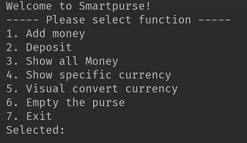
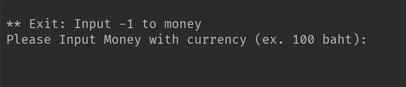
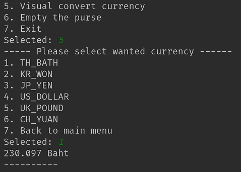

<h1>Smart purse</h1>
Smart purse is the application that can store the money with many currencies such as Baht, Yen, etc. Not only can add and deposit the money, but also can convert and calculator a specific currency that you want to know. Example, you have 100 baht in your purse, you want to know how many you got in dollar currency? This application can help! 
<h2>UML Diagram & Design Pattern</h2>
<h3>Design pattern</h3>
Part of the design pattern I use 3 design pattern which is Singleton, Strategy, and NullObject design pattern. 
<ol>
<li> Singleton is used in App and Purse class.
<li> Strategy is used in Calculator interface and Money class
<li> NullObject use for the default value of money.
</ol>
<h3>UML Diagram</h3>

<h2>How to use it?</h2>

> Run the Application and you will see the Main Menu  
>>

> Select the function you want to use. If you select the add or deposit money you will see the menu as the picture below.
 
>Then input the money with currency 
><b> Ex. 100 baht</b>  
>   <i>If you want to go back to main menu please type <b> -1 </b></i>
>>

> Another function such as show all money. The program will show all money with the currency.
>>

>The last function that is the important function I want to present is Visual Convert Currency. Whatever currency you have it will convert to the currency you want..
>>

> If you want to exit the program then select choice 7.
>>

